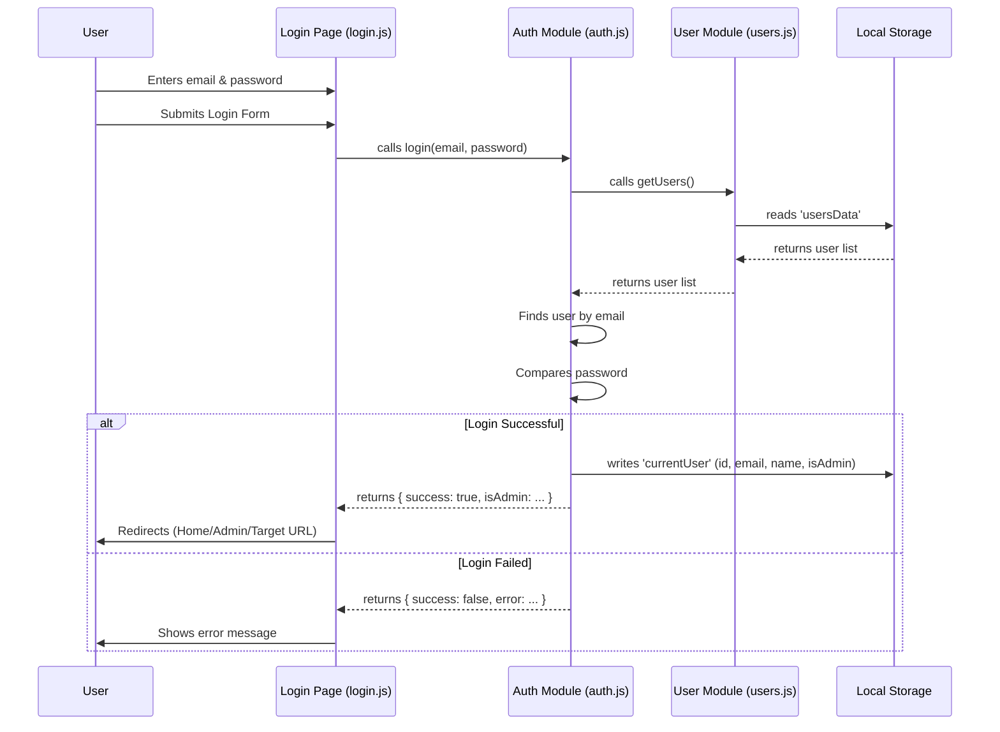
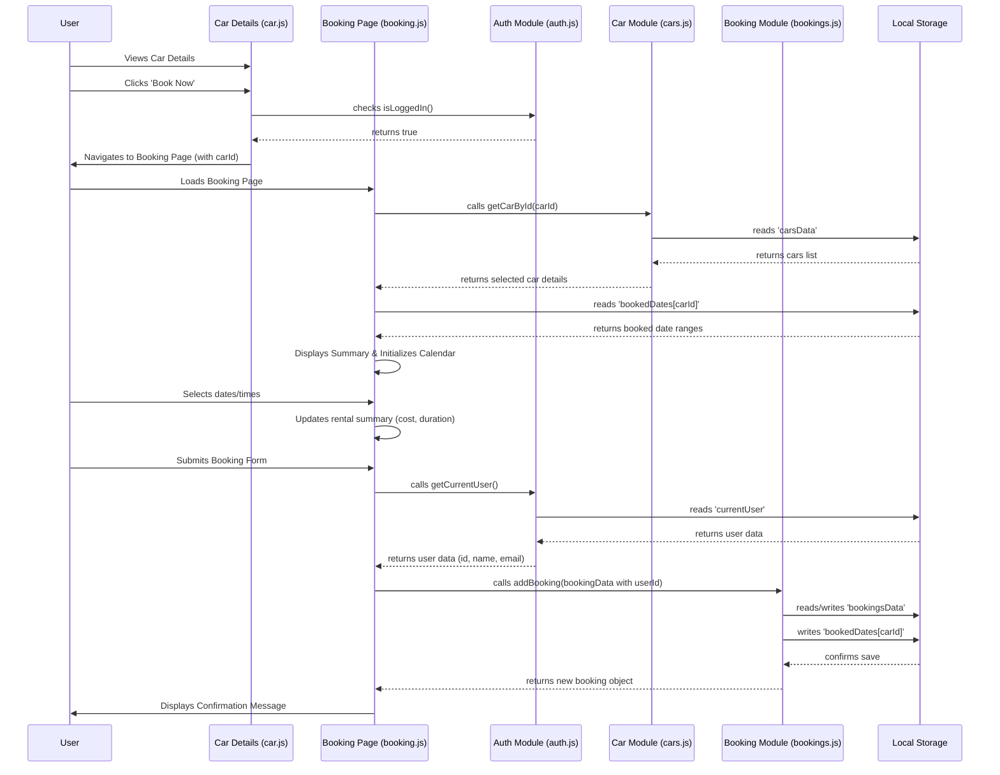

# Car Rental System

## 1. Introduction

This project is a web-based Car Rental System demonstration. It allows users to browse available cars, view details, and make bookings (if logged in). It also features an admin panel for managing cars, users, and bookings. The project is built using standard web technologies (HTML, CSS, JavaScript) with the help of Bootstrap for styling and Vite for development and building. Data is currently persisted using the browser's Local Storage for simplicity.

## 2. Tooling and CI/CD

This project utilizes several tools for a modern development workflow: [**Vite**](https://vitejs.dev/) provides a fast development server and build process; [**Bootstrap 5**](https://getbootstrap.com/) handles responsive styling and components; [**ESLint**](https://eslint.org/) and [**Stylelint**](https://stylelint.io/) enforce JavaScript and CSS code quality; [**JSDoc**](https://jsdoc.app/) is used for code documentation and type hinting within JavaScript comments; [**Prettier**](https://prettier.io/) ensures consistent code formatting; [**Husky**](https://typicode.github.io/husky/) and [**lint-staged**](https://github.com/okonet/lint-staged) automate code checks before commits; and [**GitHub Actions**](https://github.com/features/actions) manage Continuous Integration and Deployment (CI/CD) to GitHub Pages, automating linting, building, and deployment on pushes to the main branch.

## 3. Folder Structure and Naming Conventions

The project follows a standard structure for web projects:

- **`/` (Root):** Contains HTML files for each user-facing and admin page (e.g., `index.html`, `cars.html`, `admin-dashboard.html`, `login.html`). Also contains configuration files (`vite.config.js`, `package.json`, `.eslintrc.mjs`, etc.).
- **`css/`:** Contains all CSS files.
  - `main.css`: Global styles and theme variable definitions.
  - Specific CSS files (e.g., `index.css`, `admin.css`) contain styles primarily for their corresponding pages/sections.
- **`js/`:** Contains all JavaScript files.
  - **`js/pages/`:** Contains JavaScript files specific to one HTML page (e.g., `js/pages/index.js` handles logic for `index.html`, `js/pages/admin-cars.js` handles logic for `admin-cars.html`). File names generally match the HTML page they serve.
  - **`js/modules/`:** Contains reusable JavaScript modules responsible for managing specific data entities or core functionalities (e.g., `cars.js`, `users.js`, `auth.js`, `bookings.js`). These modules handle the data logic and interaction with Local Storage.
  - **`js/utils/`:** Contains utility helper functions used across different pages or modules (e.g., `helpers.js` for theme toggling, DOM manipulation, formatting, validation, toast notifications).
- **`scripts/`:** Contains utility scripts, like `run-expose.js` for development purposes (using Tunnelmole).
- **`.github/workflows/`:** Contains GitHub Actions workflow files (like `ci.yaml`).
- **`.husky/`:** Contains Git hook scripts managed by Husky.
- **`dist/`:** (Generated by `npm run build`) Contains the optimized, production-ready files built by Vite. This folder is usually ignored by Git (`.gitignore`) but is the target for deployment.

## 4. Data Structures and Modules (Data Flow)

Data persistence in this project is handled **using the browser's Local Storage**. This is suitable for demonstration but has limitations (limited storage space, synchronous, not secure for sensitive data like passwords). The core data logic is encapsulated in modules within `js/modules/`.

- **Data Entities:**

  - **Cars:** Managed by `js/modules/cars.js`. Stored under the key `carsData`. Each car object typically has: `id`, `brand`, `model`, `type`, `rentPerDay`, `imageUrl`, `description`, `features` (array), `availability` (boolean), `isFeatured` (boolean).
  - **Users:** Managed by `js/modules/users.js`. Stored under the key `usersData`. Each user object has: `id`, `email`, `password` (plain text - **insecure demo!**), `firstName`, `lastName`, `nationalId`, `phoneNumber`, `isAdmin` (boolean), `verified` (boolean).
  - **Bookings:** Managed by `js/modules/bookings.js`. Stored under the key `bookingsData`. Each booking object has: `id`, `carId`, `userId`, `customerName`, `customerEmail`, `pickupDate`, `pickupTime`, `dropoffDate`, `dropoffTime`, `totalCost`, `status` ('pending', 'confirmed', 'cancelled'). When bookings are retrieved by `getBookings()`, the module often enriches them with basic `carDetails` by looking up the `carId`.

- **Core Modules:**

  - `cars.js`, `users.js`, `bookings.js`: Provide functions to get, add, update, and delete their respective data entities from Local Storage (CRUD operations). They often include `_initMock*` functions to populate Local Storage with sample data if it's empty.
  - `auth.js`: Handles user authentication. It uses `users.js` to find users and verify passwords. It stores the _currently logged-in user's_ essential (non-password) details in Local Storage under the `currentUser` key. Provides functions like `login()`, `signup()`, `logout()`, `isLoggedIn()`, `isAdmin()`, `getCurrentUser()`.
  - `helpers.js` (`js/utils/`): Provides common utility functions like `formatCurrency()`, `formatDate()`, `formatDateTime()`, `showToast()`, `validateForm()`, `attachThemeToggler()`, `checkAdminLogin()`, `getQueryParam()`. It does _not_ manage core application data.

- **Data Flow Example (User Login):**
  1.  User enters email/password on `login.html`.
  2.  Form submission triggers `js/pages/login.js`.
  3.  `loginFormHandler` calls `login()` from `js/modules/auth.js`, passing email and password.
  4.  `auth.js` calls `getUsers()` from `js/modules/users.js` to retrieve all users from Local Storage.
  5.  `auth.js` finds the user by email and compares the provided password.
  6.  If successful, `auth.js` stores user info (excluding password) in Local Storage (`currentUser`) and returns `{ success: true, isAdmin: ... }`.
  7.  `js/pages/login.js` receives the success response and redirects the user (e.g., to `/` or `/admin-dashboard.html` or a specific `redirect` URL).
  8.  On subsequent page loads, other scripts can call `isLoggedIn()` or `isAdmin()` from `auth.js` to check the user's status by looking for the `currentUser` data in Local Storage.

### User Login Flow Diagram

### Car Booking Flow Diagram

## 5. Working Functionality (User Stories)

#### As a General User, I can:

- Visit the homepage to see featured vehicles and offers (`index.html`).
- Navigate to the "Explore Cars" page (`cars.html`).
- Filter the list of cars by type (Sedan, SUV, etc.), maximum price, and search term (brand/model).
- View details of a specific car, including its description, features, price, and availability (`car.html`).
- Register for a new account by providing personal details, email, and password (`signup.html`).
- Log in using my email and password (`login.html`).
- If logged in, book an available car by selecting pickup/drop-off dates and times (`booking.html`). The system prevents booking unavailable cars or already booked dates (using Flatpickr calendar integration).
- If logged in, view my past and present bookings, including car details, dates, cost, and status (`booking-history.html`).
- View the contact page with contact information and a map (`contact.html`).
- Toggle the website theme between light and dark mode using the theme toggler button in the navbar.

#### As an Admin User, I can:

- Log in through the standard login page (`login.html`). The system recognizes me as an admin based on my user data.
- Access the Admin Panel sidebar and navigate between admin sections.
- View a dashboard overview with key statistics like total cars, total bookings, and pending bookings (`admin-dashboard.html`).
- Manage the car inventory:
  - View a table of all cars (`admin-cars.html`).
  - Add a new car with details (brand, model, type, price, image URL, description, features) via a modal form.
  - Edit the details of an existing car via the same modal form.
  - Delete a car from the inventory (with confirmation).
- Manage bookings:
  - View a table of all bookings, sortable by date (`admin-bookings.html`).
  - Filter bookings by status (Pending, Confirmed, Cancelled) or pickup date.
  - Change the status of a booking (e.g., confirm a pending booking, cancel a booking) via a modal.
- Manage users:
  - View a table of all registered users (`admin-users.html`).
  - Edit user details (name, email, phone, verified status) via a modal form.
  - Toggle the "Verified" status of a user directly from the table or the edit modal.
  - Delete non-admin users (with confirmation). Deleting admin users is prevented.
- View reports:
  - See charts visualizing data like bookings by status and cars by type (`admin-reports.html`).
  - See general statistics like total users, verified users, etc.
- Log out of the admin panel.
- Toggle the website theme between light and dark mode.

## 6. Future Work

Key areas for future improvement include:

- **Build-Time Includes:** Use Vite plugins or a static site generator (like Astro) to manage repeated HTML sections (header, footer, admin sidebar) during the build process, avoiding client-side layout scripts.
- **Auth-Aware Footer:** Dynamically update the footer content based on whether a user is logged in (e.g., show username/logout link).
- **TypeScript Migration:** Convert the codebase from JavaScript to TypeScript for enhanced type safety and maintainability, building upon the existing JSDoc hints.
- **Admin Offer Management:** Add an admin section (UI and data module) to create, edit, and delete special offers displayed on the homepage.
- **Backend Integration:** Replace Local Storage with a proper backend database and API for secure and scalable data persistence and authentication.
- **Enhanced Booking Logic:** Implement real-time conflict checking, grace periods, and potential payment integration.
- **Improved User Experience:** Add features like password reset, email notifications, and advanced search/filtering.
